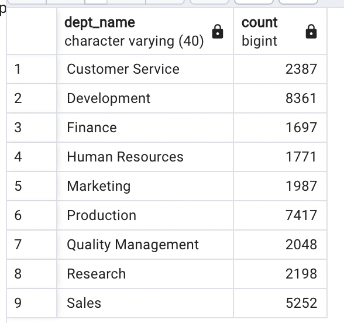
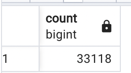

# Pewlett-Hackard-Analysis: Mass Exodus

### Overview

As large numbers of employees retire, Pewlett Hackard is preparing for the future. The company is planning to offer a retirement package to eligible employees. Also, they need to determine how many and which positions will need to be filled. Pewlett Hackard needs to prepare for possibly thousands of job openings to replace the retirees. 

#### Data to collect and analyze

In order to do this Pewlett Hackard needs the following information:
* Who will be retiring in the next few years?
* How many positions will the company need to fill in each department?
* How many employees and which employees are eligible for the retirement package? 

Currently, Pewlett Hackard employs 240,124 people. The chart below shows the distribution across
the departments. 

### Results

#### Number of Positions by Title and Department

* 72,458
* 33,118
* four major points

 
 
  

 
 #### Employees Eligible for Retirement Package
 
  
 
#### Employees Eligible for the Mentorship Program

* 1549
* four major points

### Summary

#### Insight

Provide high-level responses to the following questions, 
How many roles will need to be filled as the "silver tsunami" begins to make an impact?
Are there enough qualified, retirement-ready employees in the departments to mentor the next generation of Pewlett Hackard employees?

#### Recommendations

provide two additional queries or tables that may provide more insight into the upcoming "silver tsunami."

