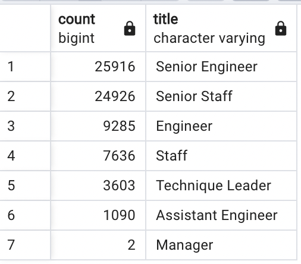

# Pewlett-Hackard-Analysis: Mass Exodus

### Overview

As large numbers of employees retire, Pewlett Hackard is preparing for the future. The company is planning to offer a retirement package to eligible employees. Also, they need to determine how many and which positions will need to be filled. Pewlett Hackard needs to prepare for possibly thousands of job openings to replace the retirees. 

#### Data to collect and analyze

In order to do this Pewlett Hackard needs the following information:
* Who will be retiring in the next few years?
* How many positions will the company need to fill in each department?
* How many employees and which employees are eligible for the retirement package? 

Currently, Pewlett Hackard employs 240,124 people. The chart below shows the distribution across
the departments. 

 

### Results

#### Number of Retirees by Title 

* There are a total of 72,458 people retiring at PH in the next few years. That is roughly 30% of the total number of employees.
* Almost 26,000 employees are Senior Engineers.
* Almost 25,000 employees are Senior Staff.
* It makes sense that a lot of the employees retiring would be senior employees.
* However, there is only 2 managers retiring.

 
 
  
 
#### Employees Eligible for the Mentorship Program

* A total of 1,549 employees are eligible for the mentorship program.
* Roughly 33% of these employees are Senior Staff. 
* The next highest group that is eligible are the Engineers.
* Assistant Engineers's have only 78 employees eligible. 

 

### Summary

#### Insight

Over 72,458 employees will be retiring over the next three years. These employees span seven titles and various departments.
There are more than enough retirement-ready employees to mentor the next generation at PH. However, there only 1,549 eligible for the 
mentorship. This issue requires attention. PH will need to hire and train a lot more employees over the next few years. 

#### Recommendations

Further recommendations are to examine the numbers of retirees from each department so managers can start hiring and training. Also, re-examine the
eligiblity requirements for the mentorship program. PH needs more employees in the mentorship program to eventually take the place of the retirees. 

It would be really helpful to be provided data dictionaries with the tables. This would help provide a better picture as to what is the relationship between 
the tables and the varies "to_dates". For example, are the `to_dates` from the titles table the same as the 'to_dates in the salaries and dept_emp tables? 
provide two additional queries or tables that may provide more insight into the upcoming "silver tsunami."

